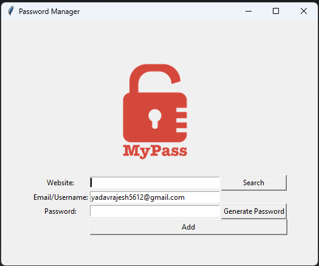

# Password Manager

A effective **Password Manager** built using Python and Tkinter. This application allows users to generate strong passwords, store them securely in a text file, and copy them directly to the clipboard for ease of use.

## 🚀 Features

- **Random Password Generator**: Creates strong and unique passwords using a mix of letters, numbers, and symbols.
- **Clipboard Support**: Automatically copies the generated password to the clipboard for quick access.
- **Secure Storage**: Saves credentials in a structured format within a `password.txt` file.
- **User-Friendly Interface**: Built with Tkinter for an intuitive and easy-to-use GUI.

## 🛠️ Installation

Ensure you have **Python 3.x** installed on your system before proceeding.

### 1. Clone the repository
```sh
git clone https://github.com/your-username/password-manager.git
cd password-manager
```

### 2. Install Dependencies
```sh
pip install pyperclip
```

### 3. Run the Application
```sh
python main.py
```

## 📸 Screenshots
 

## 📝 Usage

1. **Enter Website**: Input the name of the website.
2. **Enter Email/Username**: Provide the associated login email or username.
3. **Generate Password**: Click the `Generate Password` button to create a strong password.
4. **Save Credentials**: Click `Add` to store the credentials in `password.txt`.
5. **Copy to Clipboard**: The password is automatically copied for convenience.

## 🛡️ Security Considerations

- The passwords are saved in a plain-text file (`password.txt`). Consider encrypting or using a database for better security.
- Avoid sharing your saved file with others to prevent unauthorized access.

## 🤝 Contributing

Feel free to fork this repository and submit pull requests for enhancements!

---
Made with ❤️ by [Rajesh Yadav](https://github.com/your-username)

